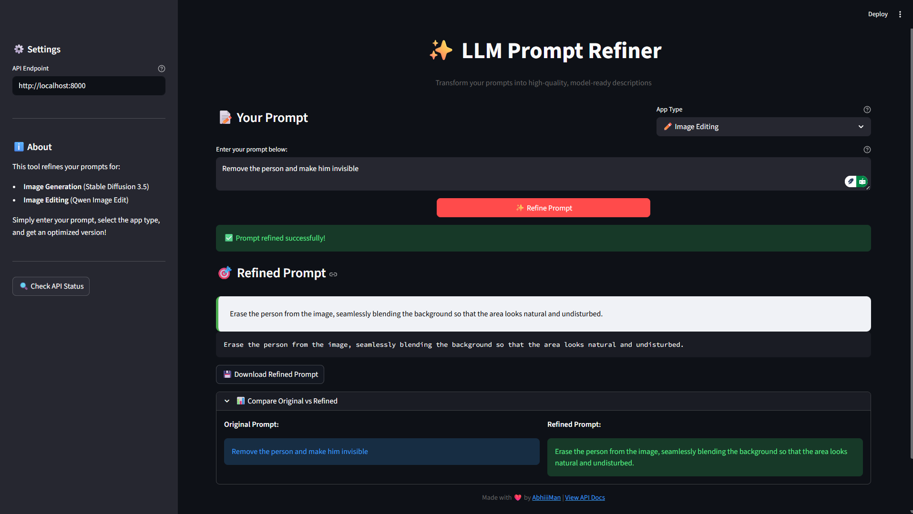
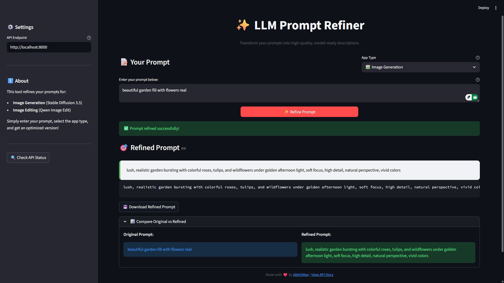

<div align="center">

# ✨ LLM Prompt Refiner

### Transform Your Prompts into High-Quality, Model-Ready Descriptions

[](https://www.python.org/downloads/)
[](https://fastapi.tiangolo.com/)
[](https://streamlit.io/)
[](LICENSE)

_Optimize your prompts for image generation and editing with AI-powered refinement_

[Features](#-features) • [Installation](#-installation) • [Usage](#-usage) • [API Documentation](#-api-documentation) • [Contributing](#-contributing)

</div>

---

## 📋 Table of Contents

- [Overview](#-overview)
- [Features](#-features)
- [Demo](#-demo)
- [Tech Stack](#-tech-stack)
- [Installation](#-installation)
- [Usage](#-usage)
- [API Documentation](#-api-documentation)
- [Project Structure](#-project-structure)
- [Configuration](#-configuration)
- [Examples](#-examples)
- [Contributing](#-contributing)
- [License](#-license)

---

## 🌟 Overview

**LLM Prompt Refiner** is an intelligent tool that enhances your prompts for AI image generation and editing models. Using advanced language models, it transforms simple prompts into detailed, optimized descriptions that yield better results from models like **Stable Diffusion 3.5** and **Qwen Image Edit**.

### Why Use LLM Prompt Refiner?

- 🎯 **Optimized Results**: Get better quality outputs from your AI models
- 🚀 **Save Time**: No need to manually craft complex prompts
- 💡 **Learn Best Practices**: Understand what makes a good prompt
- 🔄 **Flexible**: Works for both image generation and image editing
- 🌐 **Easy to Use**: Beautiful web UI and RESTful API

---

## ✨ Features

### 🎨 Web Interface

- Clean, modern Streamlit UI
- Real-time prompt refinement
- Side-by-side comparison of original vs refined prompts
- Download refined prompts as text files
- API health monitoring

### 🔌 RESTful API

- FastAPI-powered backend
- Interactive API documentation (Swagger UI)
- JSON request/response format
- Proper error handling and validation
- CORS support for cross-origin requests

### 🤖 AI-Powered Refinement

- Powered by LiteLLM for flexible model integration
- Optimized for Stable Diffusion 3.5 (image generation)
- Optimized for Qwen Image Edit (image editing)
- Context-aware prompt enhancement
- Removes filler words and improves clarity

---

## 📸 Demo



### Real Usage Test

> User Prompt - "White male early 30's blue eyes brown hair and dimples, geek nerd tattoo all over his arms. Jim halpert, bo burnham feel, 90's cartoon animation"

> Output


> Our Refined Prompt - "White male early 30s, blue eyes, brown hair, dimples, geeky nerd look, full sleeve tattoos on arms, Jim Halpert vibe, Bo Burnham comedic presence, in 1990s cartoon animation style, vibrant colors, highly detailed, expressive face, dynamic pose, studio quality."

> Output


## 🛠 Tech Stack

| Component                  | Technology         |
| -------------------------- | ------------------ |
| **Backend Framework**      | FastAPI            |
| **Frontend UI**            | Streamlit          |
| **LLM Integration**        | LiteLLM            |
| **API Documentation**      | Swagger UI / ReDoc |
| **Python Version**         | 3.8+               |
| **Environment Management** | python-dotenv      |

---

## 📦 Installation

### Prerequisites

- Python 3.8 or higher
- pip package manager
- Git

### Step 1: Clone the Repository

```bash
git clone https://github.com/abhiiiman/LLM_Prompt_Refiner.git
cd LLM_Prompt_Refiner
```

### Step 2: Create Virtual Environment (Recommended)

```bash
# Windows
python -m venv venv
venv\Scripts\activate

# Linux/Mac
python3 -m venv venv
source venv/bin/activate
```

### Step 3: Install Dependencies

```bash
pip install fastapi uvicorn streamlit litellm python-dotenv requests pydantic
```

### Step 4: Configure Environment Variables

Create a `.env` file in the root directory:

```env
# Add any required API keys or configuration here
LITELLM_API_KEY=your_api_key_here
```

---

## 🚀 Usage

### Running the Application

You need to run both the **backend** and **frontend** simultaneously:

#### Terminal 1: Start the FastAPI Backend

```bash
# Method 1: Using Python
python backend/main.py

# Method 2: Using Uvicorn
uvicorn backend.main:app --reload --host 0.0.0.0 --port 8000
```

The API will be available at: `http://localhost:8000`

#### Terminal 2: Start the Streamlit Frontend

```bash
streamlit run app.py
```

The web interface will open automatically at: `http://localhost:8501`

### Using the Web Interface

1. **Enter Your Prompt**: Type your prompt in the text area
2. **Select App Type**: Choose between Image Generation or Image Editing
3. **Click "Refine Prompt"**: Get your optimized prompt instantly
4. **Copy or Download**: Use the refined prompt in your projects

### Using the API

#### Health Check

```bash
curl http://localhost:8000/health
```

#### Refine a Prompt

```bash
curl -X POST http://localhost:8000/refine \
  -H "Content-Type: application/json" \
  -d '{
    "user_prompt": "A beautiful landscape with mountains",
    "app_type": "image_gen"
  }'
```

---

## 📚 API Documentation

Once the backend is running, visit:

- **Swagger UI**: http://localhost:8000/docs
- **ReDoc**: http://localhost:8000/redoc

### Endpoints

#### `GET /`

Returns API information and available endpoints.

#### `GET /health`

Health check endpoint.

**Response:**

```json
{
  "status": "healthy"
}
```

#### `POST /refine`

Refines a user prompt for image generation or editing.

**Request Body:**

```json
{
  "user_prompt": "string",
  "app_type": "image_gen" | "image_edit"
}
```

**Response:**

```json
{
  "refined_prompt": "string"
}
```

**Error Responses:**

- `400`: Invalid request (e.g., invalid app_type)
- `500`: Server error (e.g., model unavailable)

---

## 📁 Project Structure

```
LLM_Prompt_Refiner/
│
├── backend/
│   └── main.py                 # FastAPI application
│
├── utils/
│   └── prompt_refiner.py       # Core prompt refinement logic
│
├── app.py                       # Streamlit web interface
├── pyproject.toml              # Project metadata
├── README.md                    # This file
├── .env                         # Environment variables (create this)
└── .gitignore                  # Git ignore rules
```

---

## ⚙️ Configuration

### Custom API Endpoint

You can configure a custom API endpoint in the Streamlit sidebar or by modifying the `API_BASE_URL` in `app.py`:

```python
API_BASE_URL = "http://your-custom-api:8000"
```

### Model Configuration

To use a different LLM model, modify the `litellm.completion()` call in `utils/prompt_refiner.py`:

```python
response = litellm.completion(
    model="your-model-name",
    api_base="your-api-base",
    # ... other parameters
)
```

---

## 💡 Examples

### Example 1: Image Generation

**Input:**

```
A cat sitting on a chair
```

**Output:**

```
Photorealistic image of a fluffy domestic cat with vibrant fur sitting elegantly
on a modern wooden chair, soft natural lighting, shallow depth of field, 4K
quality, detailed whiskers and eyes, cozy indoor setting
```

### Example 2: Image Editing

**Input:**

```
Make the sky blue
```

**Output:**

```
Transform the sky to a vibrant azure blue with realistic cloud formations,
maintain natural lighting consistency, preserve original composition, seamless
color transition, photorealistic quality
```

---

## 🤝 Contributing

Contributions are welcome! Here's how you can help:

1. **Fork the repository**
2. **Create a feature branch** (`git checkout -b feature/AmazingFeature`)
3. **Commit your changes** (`git commit -m 'Add some AmazingFeature'`)
4. **Push to the branch** (`git push origin feature/AmazingFeature`)
5. **Open a Pull Request**

### Development Guidelines

- Follow PEP 8 style guidelines
- Add comments for complex logic
- Update documentation for new features
- Test thoroughly before submitting PR

---

## 📝 License

This project is licensed under the MIT License - see the [LICENSE](LICENSE) file for details.

---

## 🙏 Acknowledgments

- [FastAPI](https://fastapi.tiangolo.com/) - Modern web framework
- [Streamlit](https://streamlit.io/) - Beautiful web apps
- [LiteLLM](https://github.com/BerriAI/litellm) - LLM integration
- [Stable Diffusion](https://stability.ai/) - Image generation
- [Qwen](https://github.com/QwenLM) - Image editing models

---

## 📧 Contact

**Abhishek Chaudhuri** - [@abhiiiman](https://github.com/abhiiiman)

Project Link: [https://github.com/abhiiiman/LLM_Prompt_Refiner](https://github.com/abhiiiman/LLM_Prompt_Refiner)

---

<div align="center">

### ⭐ Star this repository if you find it helpful!

Made with ❤️ and Python

</div>
